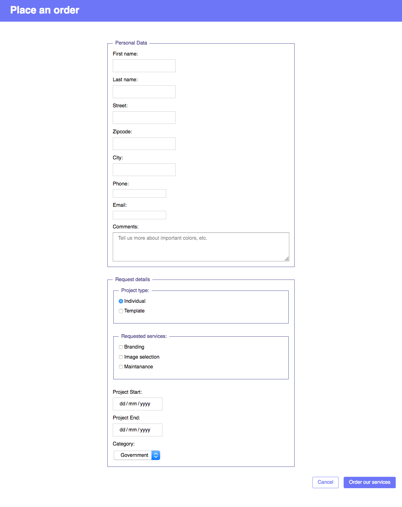

# Bare form

The bare form should contain:

* text input fields, checboxes, radio buttons, text area, date picker, 
* 2 buttons -> only 1 submits the form
* styling resembles the example image

> Can you style it without overusing classes?